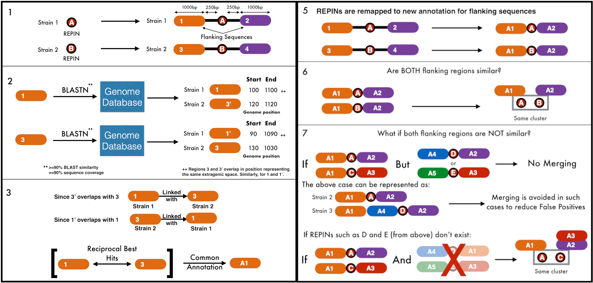
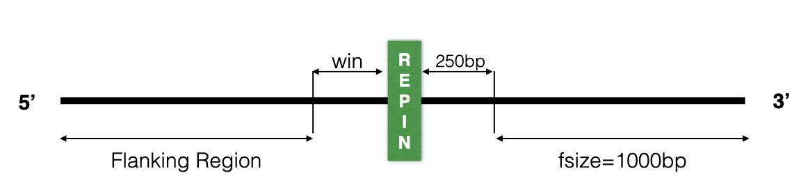

# REPIN CLUSTERER

## Installation
The tool can be installed with the command:

    pip install -i https://test.pypi.org/simple/ repinclusterer

## Introduction
repin_clusterer is a tool developed for the clustering of REPIN sequences based on their position in the genome. REPIN Sequences that are present in orthologous regions will be placed in the same cluster. The orthology is determined based on the similarity of the nucleotide sequence that flanks either side of the REPIN.
 See also: rarefan.evolbio.mpg.de

## Using this tool
The tool can be run with the command:

    repinclusterer --repin all_repins.txt --genomes genomes/ --out output_dir
  | Tag      |      Function      |      Default      |
|:------------:|:-------------:|:-------------:|
  |repin|path to the text file containing REPIN sequences or RAREFAN Dir| None|
  |genomes|path to the directory containing all the genome sequences| None|
  |out|path to where the output file should be stored| ./cluster_output|
  |win|begin flanking region after. This means that if the REPIN starts at 'x' and ends at 'y', the flanking region will begin at 'x-250' and from 'y+250'| 250 |
  |fsize|length of the flanking region to consider|1000|
  |pident|percentage sequence similarity that needs to be met|90(%)|
  |coverage|minimum length of sequence that has to align/match|90(%)|
  |withrarefan|Using RAREFAN as input? 1 for yes, 0 for no| 0|
   
  **Note**: Each tag in the command begins with two '-' dash characters followed by a space and then the argument (see example above)

## Example Dataset
We have created an example dataset for you to understand how to use the software and for a demonstration. 
Download the sample input dataset from the assets folder of the latest release. Install `repinclusterer` and run using the command as mentioned above. The output will be stored in the `cluster_output` directory in the format as mentioned below.

## Running along with RAREFAN
If you have identified REPINs from RAREFAN, you can also provide the output folder from RAREFAN as the input and `repinclusterer` will take care of the rest. There wouldn't be a need to create the input files yourself according to the required format.
Use the `--withrarefan` tag and run as: 
> repinclusterer --repin rarefan_output_dir --genomes genomes/ --withrarefan 1

## Input Format
The input files that are required are by software:
<ol><li> List of REPIN Sequences with position </li>
<li> List of all genomes whose REPINs are provided. </li>
</ol>
**Keep in mind**  
<ol>
<li> If there are REPINs whose genome sequence files are not provided, those REPINs will be dropped from the analysis</li>
<li>The file containing REPIN sequences should be formatted such that each line contains (only) the following information: 
genome_name repin_start repin_end repin_type repin_sequence
 Ex: chlTAMOak81 1008421 1008530 type0 </li>
<li>It is preferrable to provide the genome sequences in fasta format. </li>
</ol>

## Output Format
The output file is very similar to the input file with the addition of a number at the beginning of the link representing the cluster number.

> num genome_name repin_start repin_end repin_type 
> 0 chlTAMOak81 1008421 1008530 type0

Implying that this particular REPIN belongs to cluster number 0 and so on.

## Python packages used
 **Biopython**
 Cock, P. J., Antao, T., Chang, J. T., Chapman, B. A., Cox, C. J., Dalke, A., … others. (2009). Biopython: freely available Python tools for computational molecular biology and bioinformatics. _Bioinformatics_, _25_(11), 1422–1423.
 **Pickle**
 Van Rossum, G. (2020). _The Python Library Reference, release 3.8.2_. Python Software Foundation.
 **Networkx**
 Hagberg, A., Swart, P., & S Chult, D. (2008). _Exploring network structure, dynamics, and function using NetworkX_.
